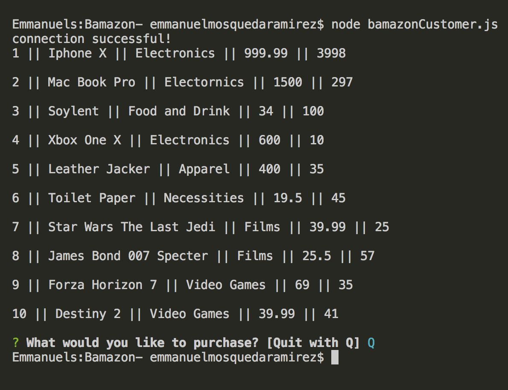

# Bamazon-
===================================================================

 This application was made to be an Amazon-like storefront using my MySQL. In the app you'll be order an iteam and the inventory will automatically adjust.

 ## The following screenshots will show the application in action. 
===================================================================

* First in the terminal we go ahead and execute the command **node bamazonCustomer.js** . This will get our app going.
 

* In the 2nd step we are going to get promt by a question, asking What we would like to buy, and from the list we are going to go ahead and a Mac Book Pro.
 

* In the 3rd step we can see that **Mac Book Pro** is a valid answer and now its going to ask for the amount of the that product that we'd like to get, we'll say 3 cause we got money.
 

* In the 4th step we can see how the stock quantity went from 300 to 297.
 

 * In this next images we are going to show how you can quit by just pressing and entering **Q**. 
 